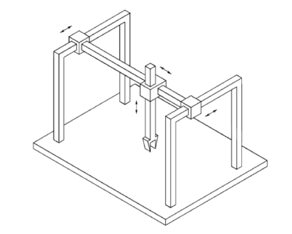
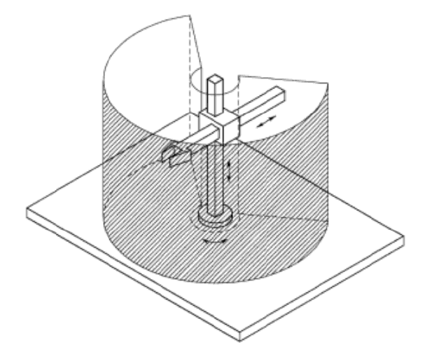
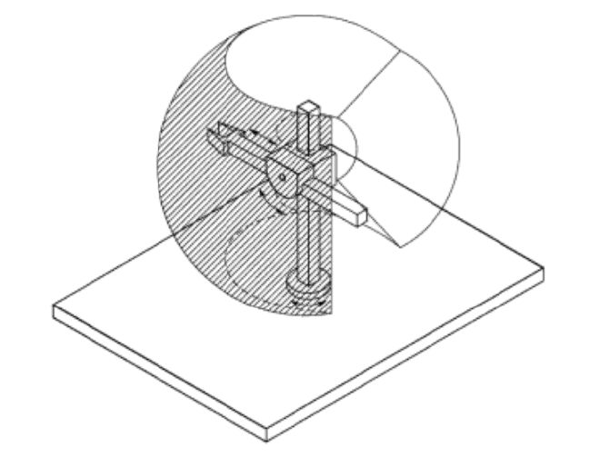
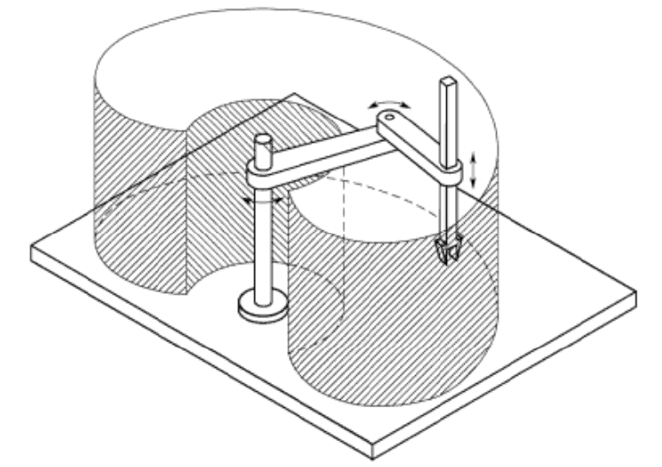
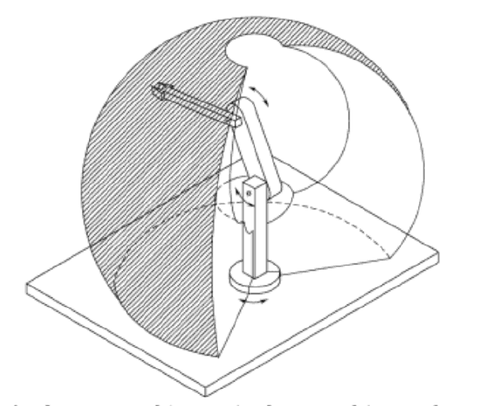

# Chapter-1

[TOC]

## 1 - Joint Type

- Prismatic
- Revolve

## 2 - Robot Types

### Cartesian Robot

- Major axis: PPP
- Work envelope: rectangular box
- Gantry robot
- Easy to control

### Cylinder Robot

- Major axis: RPP
- Work envelope: cylinder

### Spherical Robot

- Major axis: RRP
- Work envelope: sphere

### Scara Robot

- Major axis: RRP
- All three joints are vertical 
- Work envelope: complex
- Selective Compliance Assembly Robot Arm
- Applications: assembly

### Articulated Robot

- Major Axis: RRR
- Most popular, largest workspace
- Work envelope: very complex
- Applications: various

## 3 - Drive System

- Electrical
  - Most popular
- Chain drive
  - Educational
- Hydraulic
  - Most powerful
- Direct drive
  - No transmission
  - Easier to control
  - Adept one
  
## 4 - Precision, Repeatability, Accuracy

### Precision

Resolution, smallest move robot can make

### Repeatability

A measure of the ability of the robot to position the tool tip in the same place repeatedly

### Accuracy

A measure of the ability of the robot to place the tool tip at an arbitrarily prescribed location

## 5 - Degree of Freedoms

position could be changed by prismatic joints and revolute joints

but the orientation could only be changed by revolute joint

**For a structure with n joints to have n DOF, these n joints must be linear independent**

**In 3D space, the maximal number of linear independent direction is 6**