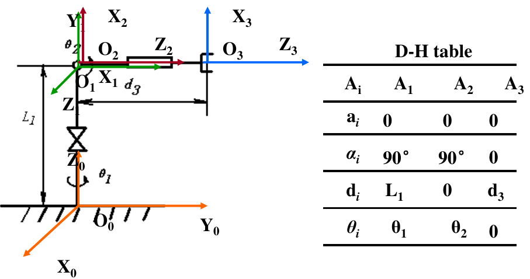
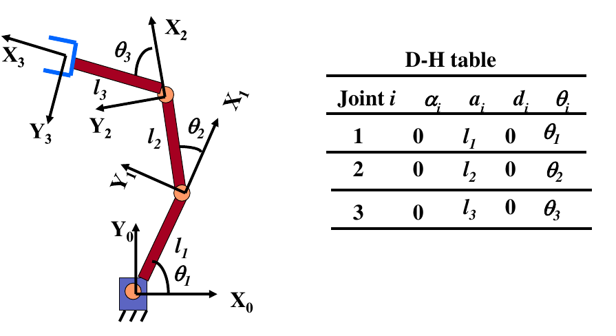
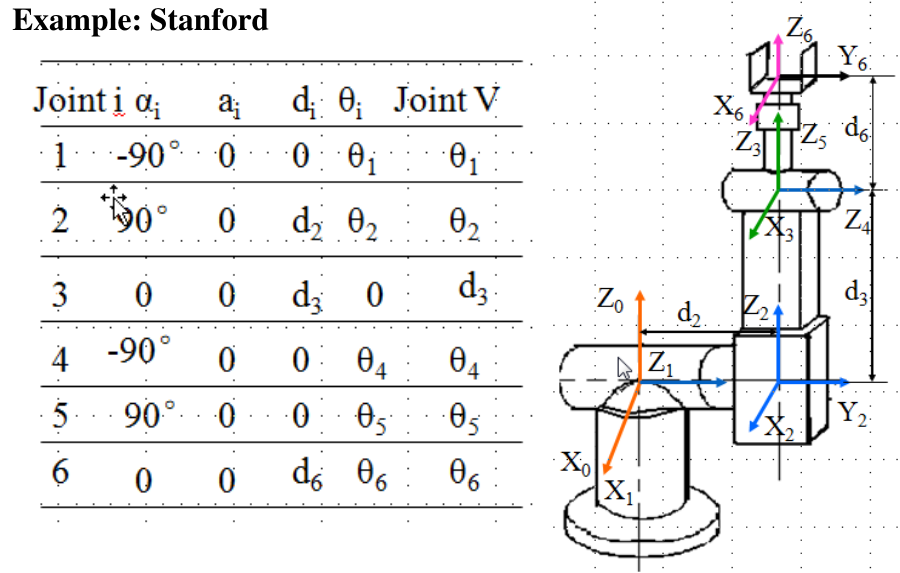
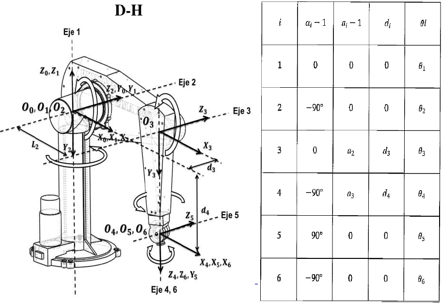
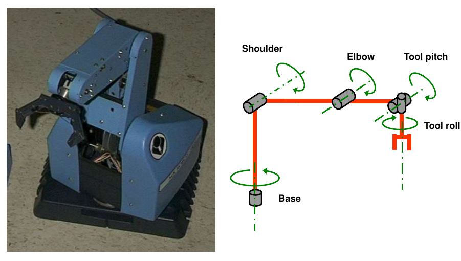
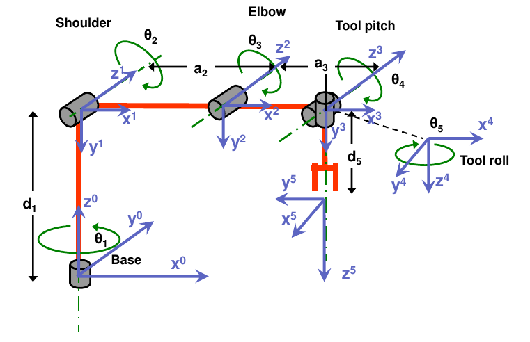
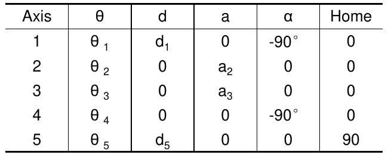

# Chapter-3

[TOC]

## 1 - Link-Connection Description

A frame is defined to attach links, which is named by number according to the attached links

### Link Parameters

#### Chains

- prismatic joint: $d_i$
- rotation joint: $\theta_i$

#### Frames

- $\alpha_i$: the angle from $\hat{Z}_i$ to $\hat{Z}_{i+1}$ measured about $\hat{X}_i$
- $a_i$: the distance from $\hat{Z}_i$ to $\hat{Z}_{i+1}$ measured along $\hat{X}_i$
- $d_i$: the distance from $\hat{X}_{i-1}$ to $\hat{X}_i$ measured along $\hat{Z}_i$
- $\theta_i$: the angle from $\hat{X}_{i-1}$ to $\hat{X}_i$ measured about $\hat{Z}_i$

and the transformation matrix becomes

$$
A_i^{i-1}=
\begin{bmatrix}
    \cos\theta_i&-\cos\alpha_i\sin\theta_i&\sin\alpha_i\sin\theta_i&a_i\cos\theta_i\\[1ex] 
    \sin\theta_i&\cos\alpha_i\cos\theta_i&-\sin\alpha_i\cos\theta_i&a_i\sin\theta_i\\[1ex]
    0&\sin\alpha_i&\cos\alpha_i&d_i\\[1ex]
    0&0&0&1
\end{bmatrix}
$$

## 2 - Examples

### EX-1

### EX-2

### EX-3

### EX-4

### EX-5

Assign frames on each joint and list the DH table

