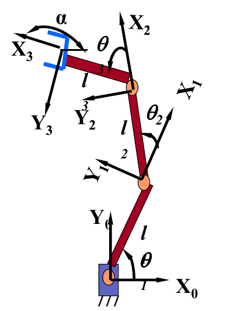
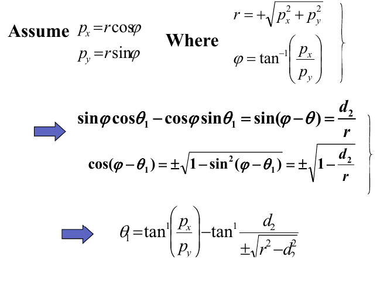
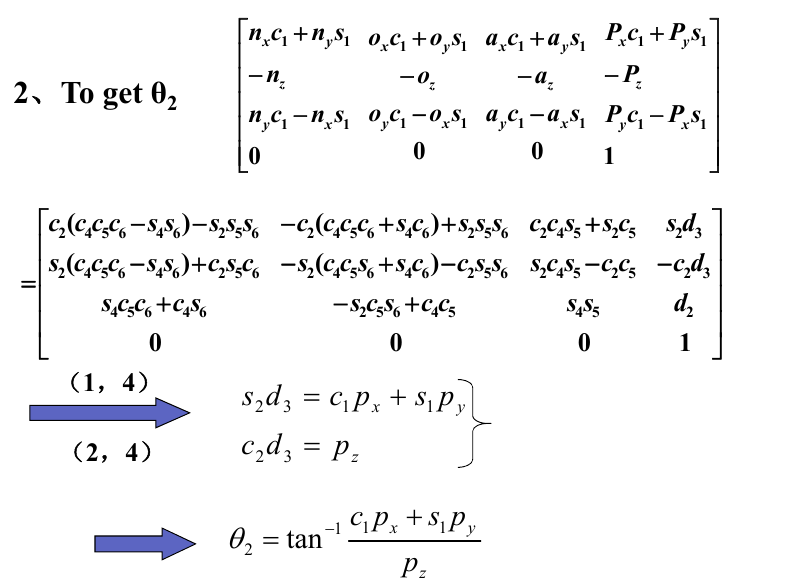
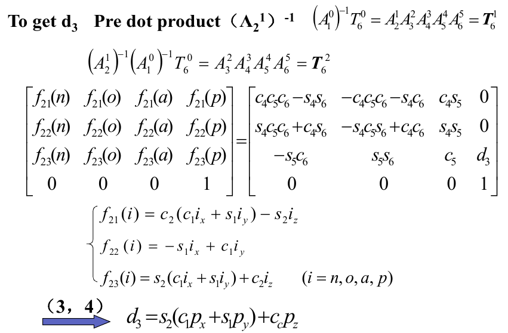
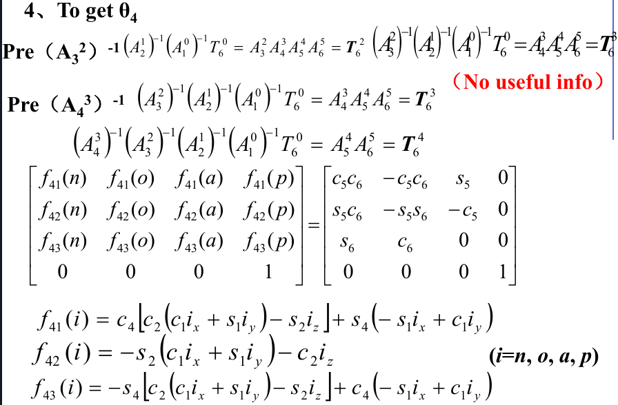
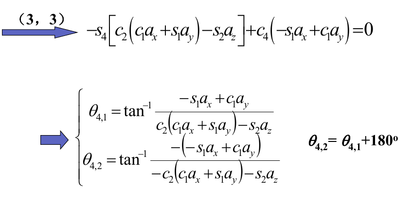
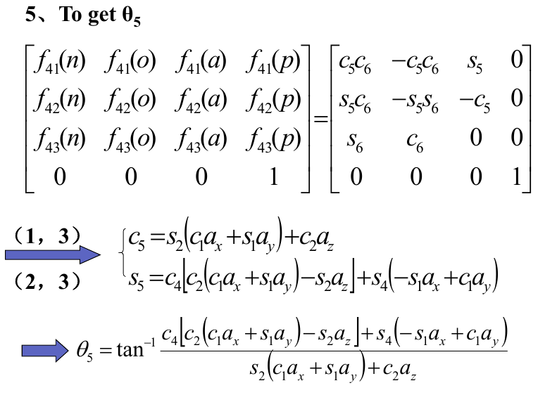
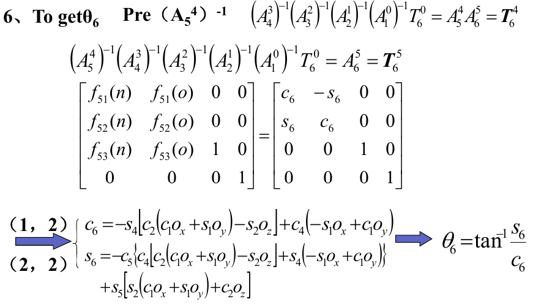

# Chapter-4

[TOC]

## 1 Introduction

Chapter 3 focused on the **direct kinematics** of manipulators, here the focus is the **inverse kinematics** of manipulators.

Solving the problem of finding the required joint angles to place the tool frame $\{T\}$, relative to the station frame, $\{S\}$, is split into two parts.

First, frame transformations are performed to find the wrist frame, $\{W\}$, relative to the base frame, $\{B\}$, and then the inverse kinematics are used to solve for the joint angles

## 2 Tool Configuration

### Definition

the arm matrix defines the position $P$ and orientation $R$ of the tool relative to base as a function of the joint variables q

$$
T_{B}^{T}(q) = 
    \begin{bmatrix}
        \begin{array}{ccc:c}
            &R&&P\\[2ex] \hdashline
            0&0&0&1
        \end{array}
    \end{bmatrix}
$$

it is called as the configuration of the tool

### Joint Space

Tool configuration space is the set of configurations that the tool can have

It is a six-dimensional vector including three position coordinates $(x_p,\;y_p,\;z_p)$ and three orientation coordinates

## 3-Examples

### Attention

- Apply tangent function
- Multi-solution
- Choose the real solution from all possible solutions by continuous motion principle

### Example 4-1

Given $l_1$, $l_2$ and $l_3$ and $p_x$, $p_y$ and $\alpha$. Get $\theta_1$, $\theta_2$ and $\theta_3$

$$
\begin{aligned}
    T_3^0 &= A_3^0\\[2ex]
    A_3^0 &= 
          \begin{bmatrix}
            c_{123}&-s_{123}&0&l_3c_{123}+l_2c_{12}+l_1c_1\\[2ex]
            s_{123}&c_{123}&0&l_3s_{123}+l_2s_{12}+l_1s_1\\[2ex]
            0&0&1&0\\[2ex]
            0&0&0&1
          \end{bmatrix}\\[2ex]
    T_3^0 &=
          \begin{bmatrix}
            c_\alpha &-s_\alpha&0&p_x\\[2ex]
            s_\alpha &c_\alpha&0&p_y\\[2ex]
            0&0&1&0\\[2ex]
            0&0&0&1
          \end{bmatrix}
\end{aligned}
$$

then we get that $\alpha=\theta_1+\theta_2+\theta_3$

$$
\begin{cases}
    l_2c_{12}+l_1c_1 = p_x-l_3c_\alpha=p_x^*\\[2ex]
    l_2s _{12}+l_1s_1 = p_y-l_3s_\alpha=p_y^*
\end{cases}
$$

square and plus we can get $\cos\theta_2$

$$
\cos\theta_2 = \frac{{p_x^*}^2+{p_y^*}^2-(l_1^2+l_2^2)}{2l_1l_2}
$$

and $\theta_1$ could be solved by substituting $\theta_2$ in the original equations

### Example 4-2

Stanford robot

$$
T_6^0 =A_1^0A_2^1A_3^2A_4^3A_5^4A_6^5
$$

Firstly, we can get $\theta_1$ from $(A_1^0)^{-1}T_6^0 =A_2^1A_3^2A_4^3A_5^4A_6^5$

since the rotation matrix is orthogonal, $AA^T = I$, $(A_1^0)^{-1}$ could be simply expressed by ${A_0^1}^T$ 

$$
\begin{aligned}
    (A_1^0)^{-1}T_6^0 &= 
    \begin{bmatrix}
        c_1&s_1&0&0\\[1ex]
        0&0&-1&0\\[1ex]
        -s_1&c_1&0&0\\[1ex]
        0&0&0&1
    \end{bmatrix}\cdot
    \begin{bmatrix}
        n_x&o_x&a_x&p_x\\[1ex]
        n_y&o_y&a_y&p_y\\[1ex]
        n_z&o_z&a_z&p_z\\[1ex]
        0&0&0&1
    \end{bmatrix}\\[2ex]
    &= 
    \begin{bmatrix}
        n_xc_1+n_ys_1&o_xc_1+o_ys_1&a_xc_1+a_ys_1&p_xc_1+p_ys_1\\[1ex]
        -n_z&-o_z&-a_z&-p_z\\[1ex]
        n_yc_1-n_xs_1&o_yc_1-o_xs_1&a_yc_1-a_xs_1&p_yc_1-p_xs_1\\[2ex]
        0&0&0&1
    \end{bmatrix}
\end{aligned}
$$

where the right side could be expressed as

$$
\begin{aligned}
    T_6^1 &= A_2^1A_3^2A_4^3A_5^4A_6^5\\[2ex]
          &= 
          \begin{bmatrix}
              c_2(c_4c_5c_6-s_4s_6)-s_2s_5s_6&-c_2(c_4c_5c_6+s_4c_6)+s_2s_5s_6&c_2c_4s_5+s_2c_5& s_2d_3\\[1ex]
              s_2(c_4c_5c_6-s_4s_6)+c_2s_5c_6&-s_2(c_4c_5s_6+s_4c_6)-c_2s_5s_6&s_2c_4s_5-c_2c_5& -c_2d_3\\[1ex]
              s_4c_5c_6+c_4s_6&-s_2c_5s_6&s_4s_5&d_2\\[1ex]
              0&0&0&1
          \end{bmatrix}
\end{aligned}
$$

since $d_2$ is known, we can get $\theta_1$ from the equation 

$$
-s_1p_x+c_1p_y = d_2
$$

